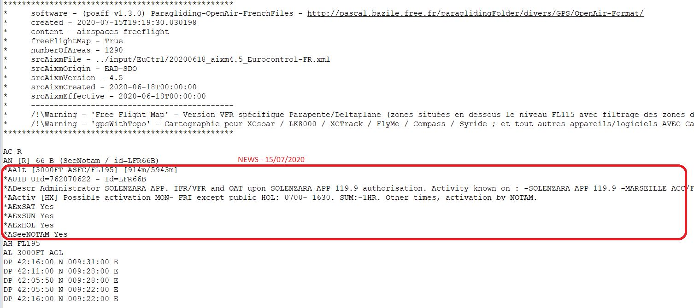
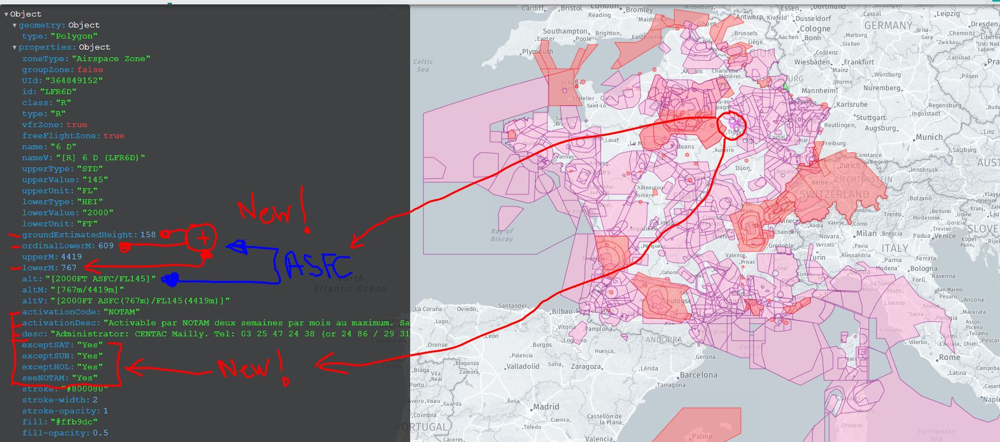

# aixmParser

*/!\ ATTENTION: Seules des données officielles doivent êtres utilisées pour la navigation aérienne.*
*/!\ WARNING  : Only official data must be used for air navigation*

Programme d'extraction et de formatage des données issues du standard AIXM (Aeronautical Information Exchange Modele)
Les fichiers actuellements générées sont les suivants:
```
a/ Catalogue des zones aériennes, disponible sous deux formats:
	- airspacesCatalog.json
	- airspacesCatalog.csv

b/ Description des zones aériennes, disponibles selon deux formats : GeoJSON (file.geojson) et Openair (file.txt)
	- airspaces-all             Cartographie complète de l'espace aérien (IFR + VFR)
	- airspaces-ifr             Cartographie de l'espace aérien IFR (zones majoritairement situées au dessus du niveau FL115)
	- airspaces-vfr             Cartographie de l'espace aérien VFR (zones situées en dessous le niveau FL115)
	- airspaces-freeflight      Cartographie de l'espace aérien dédiée Vol-Libre (dessous FL115 +filtre +compl.)
	Nota.
		- La sortie 'airspaces-freeflight' est accompagnée de deux fichiers Openair pour s'adapter aux types de GPS suivants:
			- gpsWithTopo - Cartographie pour: XCsoar / LK8000 / XCTrack / FlyMe / Compass / Syride ../.. et tout autres appareils/logiciels AVEC Carte-Topographique (en capacité de connaître les altitudes terrain)
			- gpsWithoutTopo - Cartographie pour: Flytec / Brauniger ../.. et tout autres appareils/logiciels SANS Carte-Topographique (n'ayant pas la capacité de connaître les altitudes terrain)
		- Chaque version de fichier OpenAir 'airspaces-freeflight' est accompagnée des trois déclinaisons spécifiques 'forSAT', 'forSUN' et 'forHOL' ; dépourvus des zones non-activables les jours concernés

c/ Description d'informations aéraunautique complémentaires, disponible au format GeoJSON(*):
	- aerodromes.geojson
	- towers.geojson
	- gates-stands.geojson
	- runwaysCenter.geojson
	- obstacles.geojson
	- borders.geojson
	Nota. Le fichier borders est également disponible au format Openair '.txt')

(*) AIXM - Aeronautical Information Exchange Modele : Un standard internationanl d'échange de données aéronautiques. Basé sur la technologie XML - http://www.aixm.aero/
Nota. Actuellement, seul l'ancien format AIXM 4.5 est pris en charge. Ultérieurement, ce programme évoluera pour prendre en charge la version AIXM 5.1

(*) GeoJSON - Geographic JSON.  Un format ouvert d'encodage données géospatiales. Basé sur la technologie JSON (JavaScript Object Notation) et issu du projet OpenStreetMap, il est compatible avec le système : https://www.google.fr/maps
Les données GeoJSON sont visualisables par des outils tels que : http://geojson.tools/   ou   http://geojson.io/

(*) Openair - Open airspace and terrain description language - Un format ouvert d'encodage de données aéronautiques. Basé sur un format simplifié (TEXT file format) et utilisé par  de nombreux logiciels - http://www.winpilot.com/UsersGuide/UserAirspace.asp
Les données Openair sont visualisables par des outils tels que : http://xcglobe.com/cloudapi/browser  -or-  http://cunimb.net/openair2map.php
```

## Installation
```
pip install -r requirements.txt
```

## Utilisation

Selon le choix des options de génération; le programme produira un log et les fichiers dans le dossier ./out/
Les options d'utilisations s'auto décrivent avec l'aide en ligne "aixmParser -h":
```
aixmParser v2.25.0
-----------------
Aeronautical Information Exchange Model (AIXM) Converter
Call: aixmParser <[drive:][path]filename> <Format> <Type> [<Type2> ... <TypeN>] [<Option(s)>]
With:
  <[drive:][path]filename>       AIXM source file

  <Format> - Output formats:
    -Fgeojson        GeoJSON for GoogleMap
    -Fopenair        OpenAir for aeronautical software
    -Fall            All output formats (simultaneously)

  <Type(s)> - Data to export:
    -Airspaces
    -GeoBorders
    -Obstacles
    -Aerodromes
    -RunwayCenter
    -ControlTowers
    -GateStands
    -Tall           All exported type (simultaneously)

  <Option(s)> - Complementary Options:
    -h              Help syntax
    -CleanLog       Clean log file before exec
    -Silent         Silent mode (no log-file, no system-message, but log-report is available ;-)
    -ALL            Complete aeronautic maps (IFR and VFR areas)
    -IFR            Specific upper vues of aeronautic maps (IFR areas)
    -VFR            Specific lower vues of aeronautic maps (only IFR areas, without IFR areas)
    -FreeFlight     Specific Paragliding/Hanggliding maps (out E,F,G,W areas and others...)
    -Draft          Size limitation for geojson output
	-GeojsonDigitOptimize	Integer parameter for optimize Geojson output geometry coordinates (Default=6 digits, n for round(coords, n), sample=10
	-OpenairDigitOptimize	Integer parameter for optimize Openair output geometry coordinates (Default=-1 no-change source, n for round(coords, n, sample=0)
	-EpsilonReduce  Float parameter of Ramer-Douglas-Peucker Algorithm (https://github.com/fhirschmann/rdp) for optimize output (Default=-1: <0 for no-optimize; 0 for removal-duplicates-values and no-optimize; >0 for optimize, sample=0.001)

  Samples: aixmParser ../tst/aixm4.5_SIA-FR_2019-12-05.xml -Fall -Tall -ALL -CleanLog
           aixmParser ../tst/aixm4.5_SIA-FR_2019-12-05.xml -Fgeojson -Obstacles -ControlTowers -Airspaces -ALL -CleanLog
           aixmParser ../tst/aixm4.5_SIA-FR_2019-12-05.xml -Fgeojson -Airspaces -FreeFlight -GeojsonDigitOptimize=10 -CleanLog
           aixmParser ../tst/aixm4.5_SIA-FR_2019-12-05.xml -Fopenair -Airspaces -FreeFlight -OpenairDigitOptimize=0 -CleanLog
           aixmParser ../tst/aixm4.5_SIA-FR_2019-12-05.xml -Fall -Airspaces -FreeFlight -OpenairDigitOptimize=0 -EpsilonReduce=0.001 -CleanLog


  Resources
     GeoJSON test format: http://geojson.tools/  -or-  http://geojson.io
     OpenAir test format: http://xcglobe.com/cloudapi/browser  -or-  http://cunimb.net/openair2map.php
```


## Output samples




## Credits
- [Cristian Quest](https://github.com/cquest) for the first version of parser aixm2geojson
- [Pascal Bazile](https://github.com/BPascal-91/) for complete modular rewriting of aixmPaser. For integration of: OpenAir parser and Referential estimated height of grounds
- the many open source libraries, projects, and data sources used by this software (show file content of 'requirements.txt' for complete components detail)
